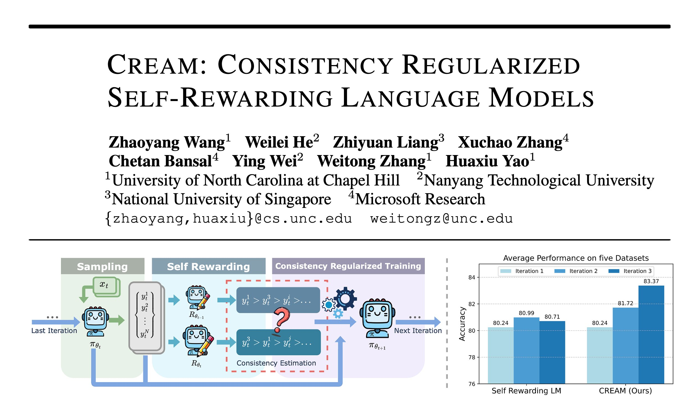

## CREAM: Consistency Regularized Self-Rewarding Language Models

This is the code repo for paper [CREAM: Consistency Regularized Self-Rewarding Language Models](https://arxiv.org/pdf/2410.12735) accepted to ICLR 2025.

CREAM extends the Self-Rewarding Language Model (SRLM) to small models (e.g., 7B-level LLMs), and mitigates the potential rewarding bias and overconfident preference labeling issues through self-consistency regularization.

<p align="center">
     <br>
</p>

**Method Overview**: CREAM will use the same LLM to serve as the policy model (which generates responses) and the reward model (which scores and ranks those generated responses). M1 model can be obtained by SFT training the initial model M0. Then, CREAM samples responses for the given question (prompt) set. Those generated responses will be judged and ranked by both current iteration's model M1 and last iteration's model M0, via DPO rewarding. Ranked responses would form the preference pair for DPO training. The differences between rankings (obtained by M1 and M0) serve as the consistency rate (Kendall’s Tau coefficient), which will be used for consistency-regularized training M1 into M2. These steps can be repeated to obtain M3, M4 and beyond. Please also refer to Algorithm 1 for details.

## Requirements

```
Python 3.10.14
transformers 4.44.2
ray 2.36.0
vllm 0.6.1.post2
deepspeed 0.15.1
torch 2.4.0
```

## Data Preparation

The labeled SFT data and unlabeled prompt data can be download in the GitHub release page. You need to divide the prompt data into several subsets for multiple iterations' training. The test set of downstream tasks including Arc-Easy/Challenge, OpenBookQA, SIQA, and GSM8K is also prepared. Please put them under `localdata` folder. Also, you need to fill the path in `config.py/DatasetEnum`.

## SFT Training

```bash
python train.py \
--device 0,1,2,3,4,5,6,7 \
--train_stage sft \
--epoch 5 --lr 5e-6 --train_bsz 4 \
--model llama3 \
--name oasst_sft
```

The saved checkpoints will be in `outputs/sft` folder. You need to fill the selected checkpoint path in `configs/checkpoint.json`. Note that you can also use DeepSpeed to save GPU memory by adding `--deepspeed configs/ds_stage2.json`.

## Preference Data Curation - Response Sampling

```bash
python infer.py \
--device 0,1,2,3,4,5,6,7 \
--mode sampling \
--model llama3 \
--name prompt_1 \
--checkpoint llama3_sft \
--output_dir outputs/sampling.json \
--sysprompt none
```

The sampling results are saved to `outputs/sampling.json`.

## Preference Data Curation - Ranking

1. First, we use the current model (say M1) to rank those sampled responses

   ```bash
   python rewarding.py \
   --device 0,1,2,3,4,5,6,7 \
   --model llama3 \
   --enable_ref yes \
   --input_file outputs/sampling.json \
   --checkpoint llama3_sft \
   --ref_model_ckpt none
   ```

2. Then, we use the last iteration's model (i.e., M0 in this case) to rank those sampled responses

   ```bash
   python rewarding.py \
   --device 0,1,2,3,4,5,6,7 \
   --model llama3 \
   --enable_ref no \
   --input_file outputs/sampling.json \
   --checkpoint none
   ```

These two ranking results are saved to the same level of the input file, named like `sampling.rewarding.xxx.json`.

## Adaptive Consistency Regularization

```bash
python cal_consistency.py \
--file1 current_model_rewarding_path \
--file2 last_model_rewarding_path \
--method consistency_avg or consistency_dyn
```

We can choose either set-level (avg) or sample-level (dyn) Kendall’s Tau coefficient to calculate the consistency rate. The resulted file `xxx.dpo.json` is formed as the preference pair, ready for DPO training. You need to fill this path in `config.py/DatasetEnum`.

## Consistency Regularized Training

```bash
python train.py \
--device 0,1,2,3,4,5,6,7 \
--model llama3 \
--checkpoint llama3_sft \
--name dpo_1 \
--method consistency_avg \
--epoch 1 --train_bsz 4 --lr 1e-6
```

The saved checkpoints will be saved to `outputs/dpo` folder. You need to fill the checkpoint path in `configs/checkpoint.json`. Then, you can start next round of training from Preference Data Curation.

## Evaluation

You can evaluate the performance on downstream tasks of the saved checkpoint `llama3_m2` by 

```bash
python infer.py \
--device 0,1,2,3,4,5,6,7 \
--model llama3 \
--checkpoint llama3_m2 \
--mode evaluation \
--name all_test \
--output_dir outputs/evaluation
```

## Citation

If you find our paper or codes useful, please kindly cite. Thank you!

```
@inproceedings{
wang2025cream,
title={CREAM: Consistency Regularized Self-Rewarding Language Models},
author={Zhaoyang Wang and Weilei He and Zhiyuan Liang and Xuchao Zhang and Chetan Bansal and Ying Wei and Weitong Zhang and Huaxiu Yao},
booktitle={The Thirteenth International Conference on Learning Representations},
year={2025},
url={https://openreview.net/forum?id=Vf6RDObyEF}
}
```

or

```
@article{wang2024creamconsistencyregularizedselfrewarding,
      title={CREAM: Consistency Regularized Self-Rewarding Language Models}, 
      author={Zhaoyang Wang and Weilei He and Zhiyuan Liang and Xuchao Zhang and Chetan Bansal and Ying Wei and Weitong Zhang and Huaxiu Yao},
      year={2024},
      eprint={2410.12735},
      archivePrefix={arXiv},
      primaryClass={cs.LG},
      url={https://arxiv.org/abs/2410.12735}, 
}
```
